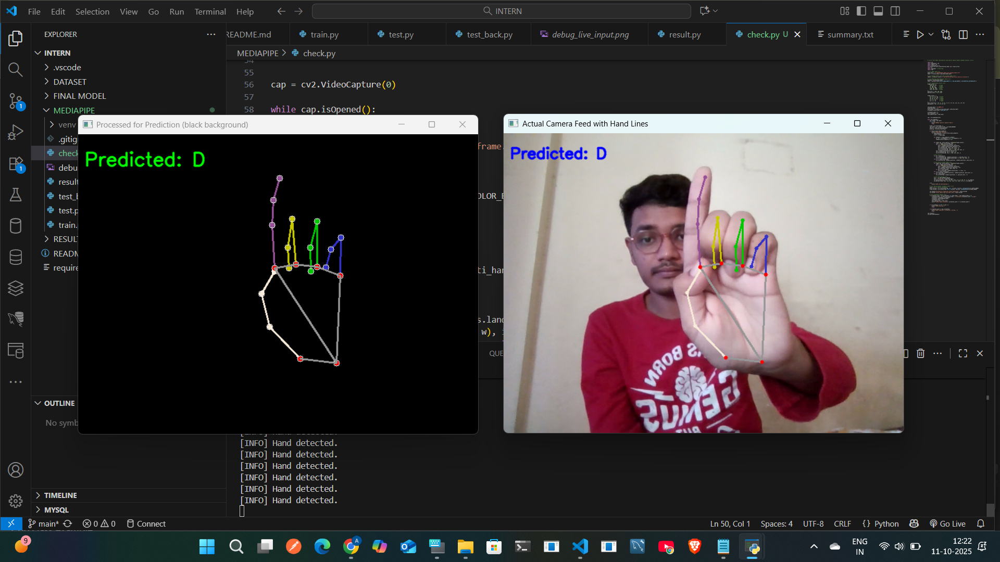
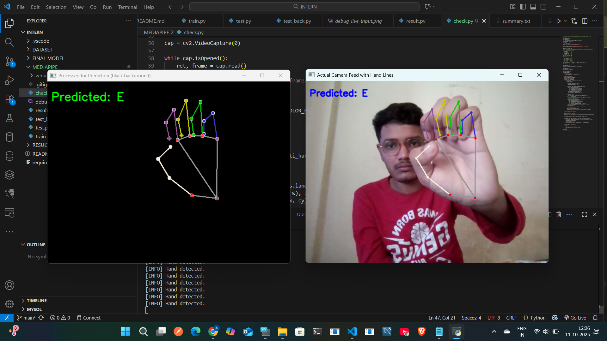
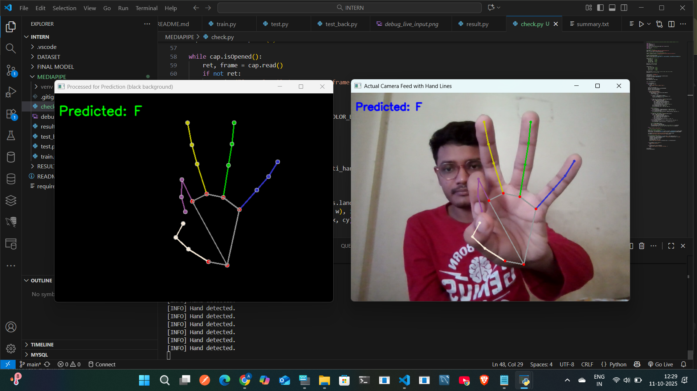
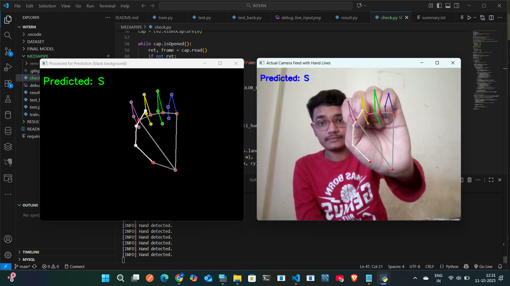
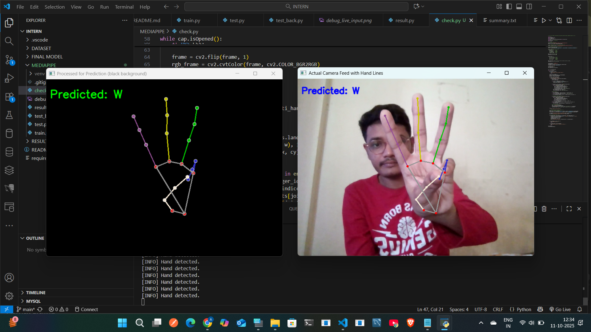
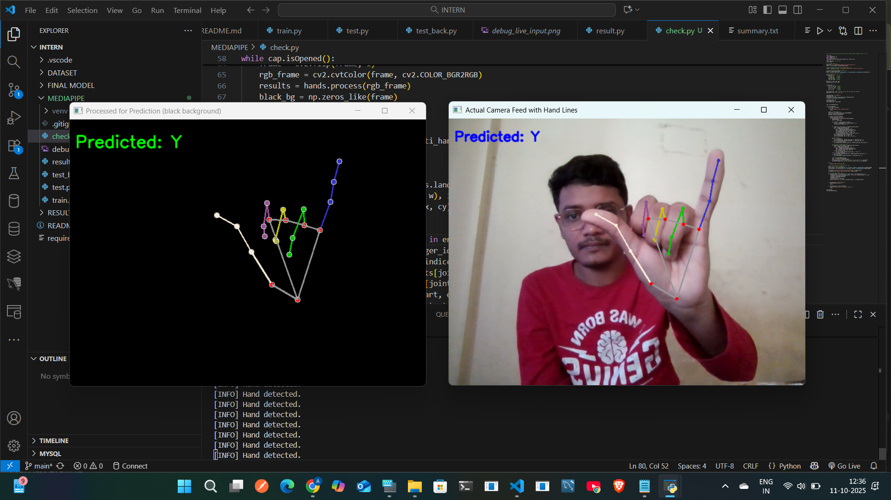

# 🤟 Real-Time Sign Language Recognition System Using MediaPipe

This project uses **deep learning** and **computer vision** to recognize American Sign Language (ASL) alphabets in real time through a webcam. It combines a **CNN model trained on ASL images** with **MediaPipe hand tracking** and **OpenCV visualization** to create an interactive and accurate gesture recognition system.

---

## YOLOv5 Version

For the YOLOv5-based implementation of this project, visit:  
https://github.com/arindampattanayak/american-sign-language-recognition-using-yolo

- ## Research Paper Link 
 🔗 [https://ieeexplore.ieee.org/document/10968373](https://ieeexplore.ieee.org/document/10968373)
  
## 🚀 Features

- Real-time hand gesture detection using webcam
- ASL alphabet classification using trained CNN model
- Hand landmark visualization using MediaPipe
- Dataset augmentation for improved model robustness

---

## WebCam Output

The following images show real-time ASL letter detection using MediaPipe from a live webcam feed.  
Detected letters include **D, E, F, S, W, and Y**.

| Letter | Output Image |
|:-------:|:-------------:|
| D |  |
| E |  |
| F |  |
| S |  |
| W |  |
| Y |  |


## 🧰 Technologies Used

### 🧠 Machine Learning / Deep Learning
- **TensorFlow** + **Keras** – Designing and training the CNN model
- **ImageDataGenerator** – For on-the-fly image augmentation during training
- **NumPy** – Efficient numerical operations and image array manipulation

### 📸 Computer Vision
- **OpenCV** – Capturing webcam feed and rendering real-time hand visualizations
- **MediaPipe** – Real-time hand landmark detection from video frames

### 📊 Evaluation & Visualization
- **scikit-learn** – Evaluation metrics like confusion matrix, classification report, ROC AUC
- **matplotlib** – Plotting confusion matrix, ROC curve, and saving sample predictions

## ⚙️ Installation & Usage Guide

Follow these steps to set up the project locally using a Python virtual environment:

---
## 📁 Dataset

This project uses a preprocessed American Sign Language (ASL) dataset based on MediaPipe hand landmarks.

You can download the dataset from Kaggle:

🔗 [MediaPipe Processed ASL Dataset (by vignonantoine)](https://www.kaggle.com/datasets/vignonantoine/mediapipe-processed-asl-dataset)

### Step 1: Clone the Repository

```bash
git clone https://github.com/arindampattanayak/american-sign-language-recognition.git
cd american-sign-language-recognition
```
### Step 2: Create a Virtual Environment

🪟 For Windows:
   ```sh
python -m venv venv
venv\Scripts\activate
```

🐧 For macOS/Linux:
   ```sh
python3 -m venv venv
source venv/bin/activate
```
 ### Step 3: Install Dependencies
 
 Make sure you have requirements.txt in your project folder. Then run:
 ```sh
 pip install -r requirements.txt
```
 If you don’t have one yet, manually install the core packages:
```sh
 pip install tensorflow opencv-python mediapipe scikit-learn matplotlib numpy
```
 ### Step 4: Update File Paths
Before running the scripts below, edit the paths in the following Python files:
Example paths to update
 ```sh
model_path = "path/to/your/model"
data_path = "path/to/your/dataset"
result_path = "path/to/save/results"
```
### Step 5: Train the Model

 ```sh
python train.py
```
This script will:
- Load the dataset
- Train a CNN model on ASL images
- Save the model with your chosen filename in your specified directory

### Step 6: Run Real-Time Prediction (Test Webcam)
Make sure your webcam is connected:
```sh
python test.py
```
This script will:
 - Start webcam feed
 - Detect and track your hand using MediaPipe
 - Predict the sign in real-time and display top-3 predictions with confidence

 ### Step 7: Evaluate Model Performance

To evaluate the model on a subset of your dataset:
 ```sh
 python result.py
```
This script will:
 - Generate a classification report
 - Save a confusion matrix image
 - Save a ROC AUC curve image
 - Save sample prediction visualizations and a summary report

## WebCam Output

The following images show real-time ASL letter detection using MediaPipe from a live webcam feed.  
Detected letters include **D, E, F, S, W, and Y**.

| Letter | Output Image |
|:-------:|:-------------:|
| D |  |
| E |  |
| F |  |
| S |  |
| W |  |
| Y |  |


## 🙌 Acknowledgements

- [MediaPipe](https://mediapipe.dev/)
- [Dataset by vignonantoine](https://www.kaggle.com/datasets/vignonantoine/mediapipe-processed-asl-dataset)


